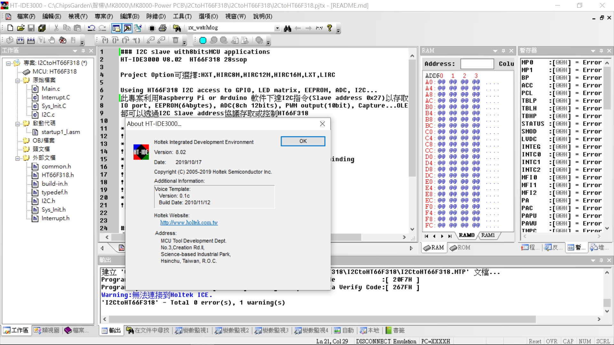
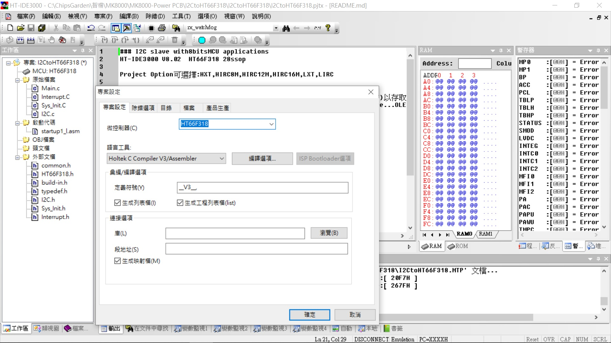
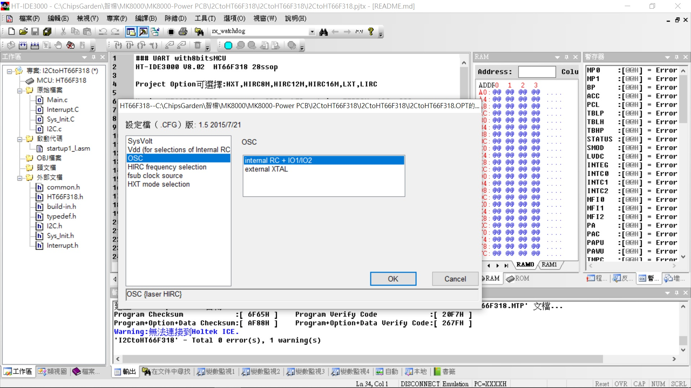
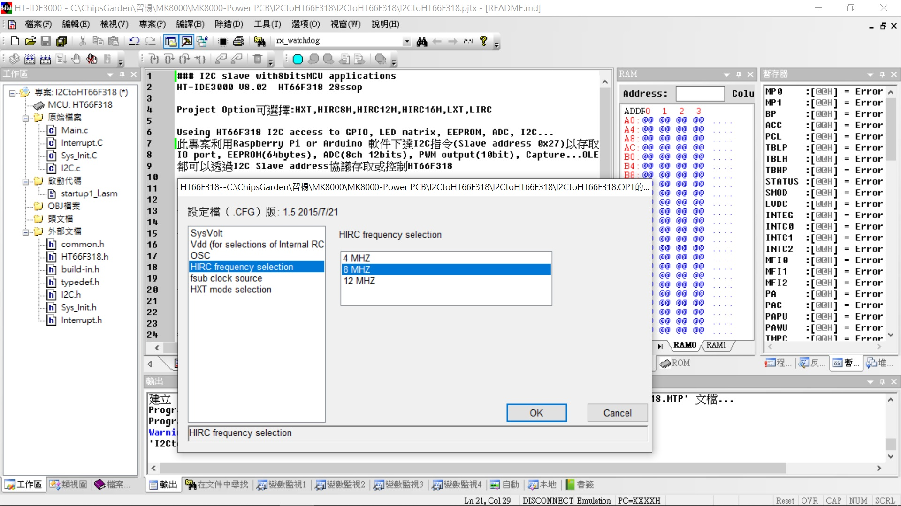
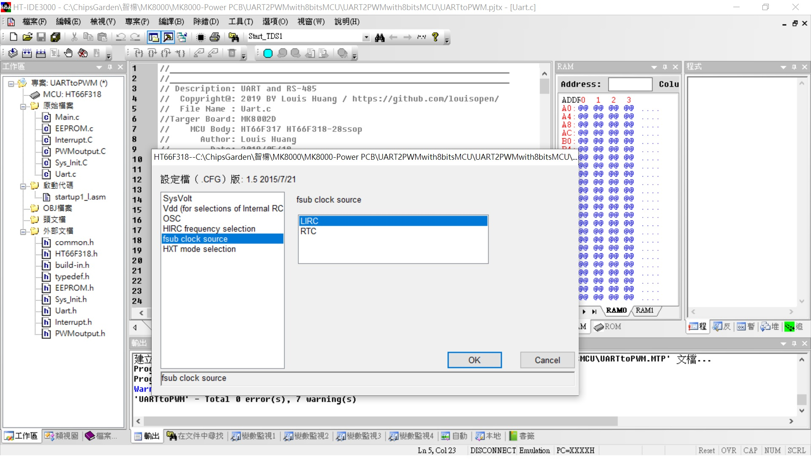
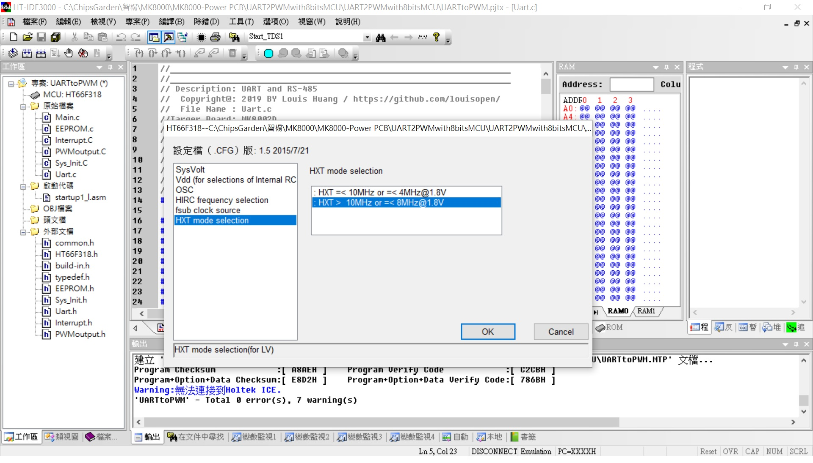
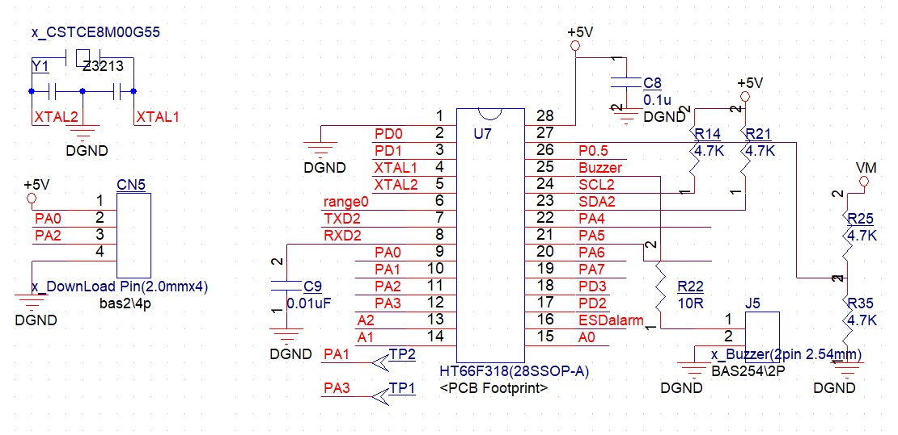

## ※I2C slave with HT66F318 applications
Using the host I2C access GPIO port, EEPROM(64bytes), ADC(8ch 12bits), PWM output(10bit), Capture, OLED display...via HT66F318 I2C port(Slave address 0x27) 
專案利用PC or Raspberry Pi or Arduino 軟件主控通過I2C下達通訊指令以存取HT66F318(Slave address 0x27)的GPIO port, EEPROM(64bytes), ADC(8ch 12bits), PWM output(10bit), Capture, OLED display... 

在MCU資源不足或是應用裝置缺乏時, Host即可透過I2C來控制這個裝置而把UART當成print for debug. 
Project Option: HIRC8M (hi speed internal RC); 可選項還有(小心使用)HXT,HIRC8M,HIRC12M,HIRC16M,LXT,LIRC 

HT66F318 28ssop with HT-IDE3000 V8.02 & e-Link & e-WriterPro 
[HT66F318 Document](https://www.holtek.com.tw/search?key=ht66F318) 
[IDE3000 & ICE & Writer](https://www.holtek.com.tw/ice) 

### Relevant information
* HT-IDE3000 V8.02

* HOLTEK C Compiler V3/Assembly

* HT66F318 Config, used 8Mhz X'tal external, VDD/VDDA binding

* HT66F318 28ssop Schematic Diagram

### How to test or used
Using PC or Raspberry Pi or Arduino Host software control I2C of MCU (Slave address 0x27)
* For Example: 
* I2C Formate: @27 44 55

### Other applications:
* 

