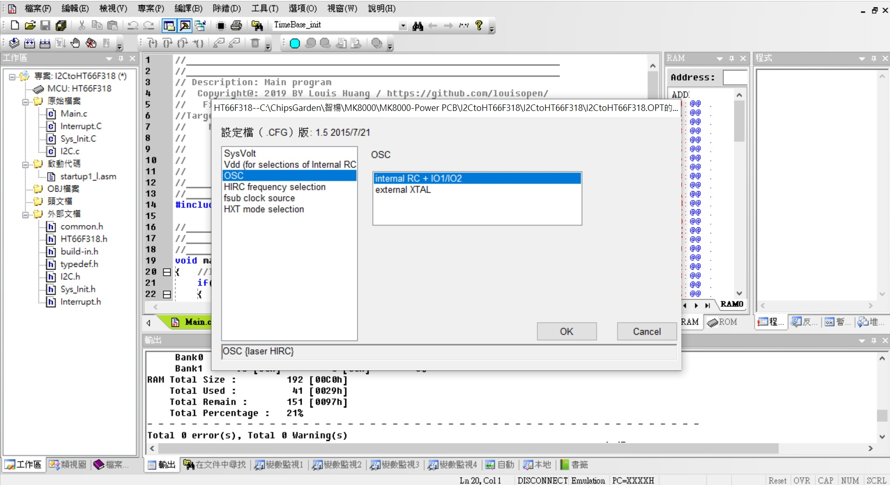

## ※I2C slave with HT66F318 applications
* Using the host I2C access GPIO port, EEPROM(64bytes), ADC(8ch 12bits), PWM output(10bit), Capture, OLED display...via HT66F318 I2C port(Slave address 0x27) 
* 專案利用PC or Raspberry Pi or Arduino 軟件主控通過I2C下達通訊指令以存取HT66F318(Slave address 0x27)的GPIO port, EEPROM(64bytes), ADC(8ch 12bits), PWM output(10bit), Capture, OLED display... 
* 在MCU資源不足或是應用裝置缺乏時, Host即可透過I2C來控制這個裝置而把UART當成print for debug. 

* Project Option:  
HIRC8M (hi speed internal RC); 可選項有:HXT(400K~16Mhz),HIRC8M,HIRC12M,HIRC16M 
LICR (Low speed internal RC for TB0/TB1); 可選項有:LXT(32.768Khz),LIRC(32Khz) 

* TB0,1 enable LIRC interrupt for 0.514sec, 0.514sec 

* TM0 enable HIRC8M interrupt for around 200us 

* I2C slave(address 0x27)

* HT-IDE3000 HT66F317/HT66F318 28ssop with HT-IDE3000 & e-Link & e-WriterPro 
文件[HT66F318 Document](https://www.holtek.com.tw/search?key=ht66F318) 
模擬&除錯Development & Debug[IDE3000 & ICE](https://www.holtek.com.tw/web/guest/ice) 
燒入器Progrmming & writer[HOPE3000 & e-WriterPro](https://www.holtek.com.tw/web/guest/programmer) 

### Relevant information
* HT-IDE3000 V8.02

* HOLTEK C Compiler V3/Assembly

* HT66F318 Config, used 8Mhz X'tal external, VDD/VDDA binding

* HT66F318 28ssop Schematic Diagram

### How to test or used
Using PC or Raspberry Pi or Arduino Host software control I2C of MCU (Slave address 0x27)
* For Example: 
* I2C Formate: @27 44 55

### Other applications:
* 

